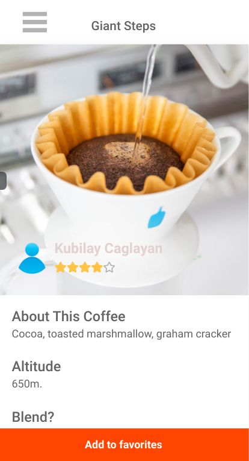
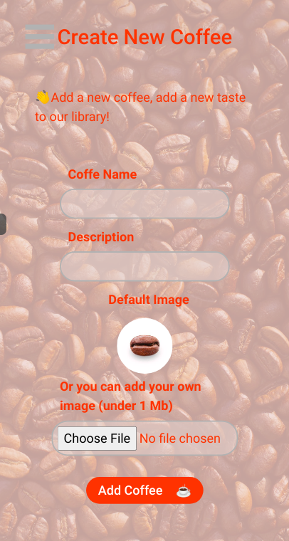
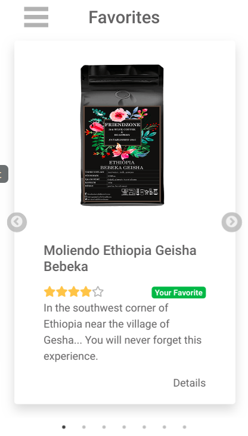
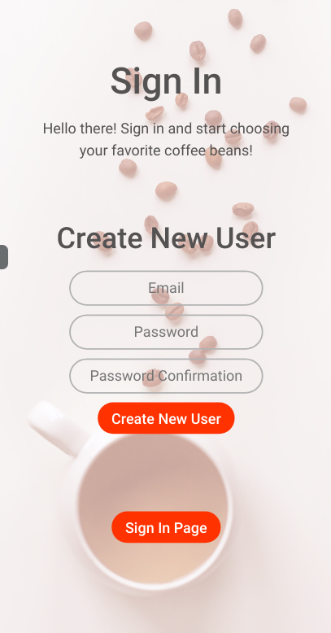
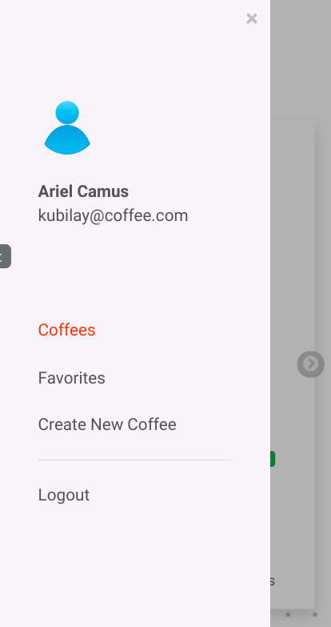

# ☕ COFFEE BEANS

> Project Description: "Find Your House"

- Browse through a list of coffee beans.
- You can add new coffee beans and put them in your favorite list.
- Also you can create your own account to secure your favorite list.

  <ul>
    <li><a href="#usage-local"><h6>Jump To: How To Use Locally</h6></a> </li>
    <li><a href="#tests"><h6>Jump To: Tests</h6></a> </li>
    <li><a href="#extras"><h6>Jump To: Nice To Have Requirements</h6></a> </li>
    <li><a href="#futurefeatures"><h6>Jump To: Future Features</h6></a></li>
    <li><a href="#contributing"><h6>Jump To: Contributing</h6></a> </li>
    <li><a href="#acknowledgments"><h6>Jump To: Acknowledgements</h6></a> </li>
  </ul>

## Live Demo

[Live Demo Link](https://coffee-kubilay.herokuapp.com/)

## Screenshots

  
  
  
  
  

## Built With

- Rails
- React
- Redux
- Jest
- RSpec

## ⭐ Getting Started ⭐

### Prerequisites
- A modern browser, up to date.
- Node.js, if you are going to use it in the local environment.
- A text editor.

### Setup
##### First clone the repository(in Terminal):
- Clone the repository: `git clone https://github.com/kubilaycaglayan/coffee.git`
- Enter the project directory: `cd coffee`
- Checkout to current the working branch `git checkout coffee`
- Run npm to install the dependencies `npm install`
- Run bundle to install the dependencies `bundle`
- Initialize the database with these set of commands `rails db:create && rails db:migrate && rails db:seed`

### <h3 id='usage-local'>🖥️ Running In The Local Environment</h3>

After setup:
- Start the server `rails s`
- You can visit the website by typing this to your browser: `http://localhost:3000/`

### <h3 id='tests'>🧪 Automated Tests</h3>

> There are two sets of tests for this project. One for Rails and one for React side.

After setup:

##### React Test (36)
- Run tests with `npm run test`
- All the API methods, reducers and actions are tested. Also, containers and components which does not require login are also tested.

##### Rails Test (51)
- Run tests with `rspec`
- All controller actions are tested with requests. Also model associations tested.

### <h3 id='extras'>Which "Nice To Have Requirements" I Have Added To My Project?</h3>
##### NTHR-1
- Implement proper user authentication from the front-end to the server
##### WHY
> I wanted to learn more about authentication relationships between rails and react, when we are not allowed to use rails views.

##### NTHR-2
- Create a user table in your database, so that a given user could only access the favourites they selected
##### WHY
> I wanted to give my users a better experience. They can have their own isolated area in the website. They customize their favorites list. Also easily scalable to other features like sending text messages.

##### NTHR-3
- Create an admin panel to <strong>create</strong> /update / delete houses
##### WHY
> I wanted to give my users a better experience. They can have create own coffees. This is not as an admin panel. Every logged in user can add a coffee to the system with an image.

### <h3 id='futurefeatures'>Future Features</h3>

- Users can delete the coffees.
- Users update coffees.
- Users can send text messages each other.

## Author

👤 **Kubilay Caglayan**

- Website: [kubilay](https://kubilaycaglayan.com)
- Github: [@kubilaycaglayan](https://github.com/kubilaycaglayan)
- Twitter: [@kbcaglayan](https://twitter.com/kbcaglayan)
- Linkedin: [linkedin](https://linkedin.com/in/kubilaycaglayan)

## <h3 id='contributing'>🤝 Contributing</h3>

Contributions, issues and feature requests are welcome!

Feel free to check the [issues page](https://github.com/kubilaycaglayan/coffee/issues).

## Show your support

Give a ⭐️ if you like this project!

## <h3 id='acknowledgments'>Acknowledgments</h3>

- Design idea by Alexey Savitskiy on Behance
- [Burger Menu](http://negomi.github.io/react-burger-menu/)
- [Carousel](https://react-slick.neostack.com/)

#### Useful Commands

- Open console in test environment
> `rails c -e test`

- Start server in test environment
> `rails s -e test`

- Reset test database
> `rails RAILS_ENV=test db:reset`

- Seed test database
> `rails RAILS_ENV=test db:seed`

- Show current database in rails console
> `ActiveRecord::Base.connection.current_database`